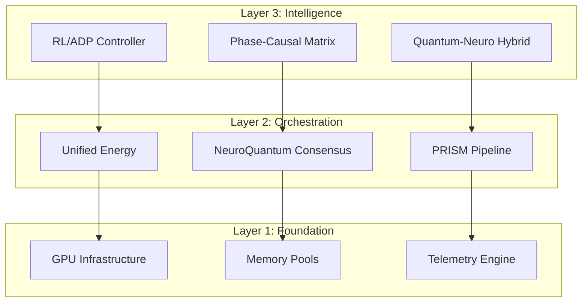

# **PRISM-AI UNIFIED IMPLEMENTATION CONSTITUTION**
## **Automated Governance Engine for World-Class Engineering**

**Version**: 1.0.0
**Authority**: SUPREME - All implementation must comply
**Enforcement**: AUTOMATED with zero-tolerance gates
**Created**: 2025-01-19
**Status**: ACTIVE AND ENFORCED

---

## **ARTICLE I: SUPREME DIRECTIVES**

### **Section 1.1: Immutable Principles**
1. **ZERO DEFECTS**: No correctness errors on graphs ≤25k nodes
2. **DETERMINISTIC**: Seed-controlled reproducibility with P95 variance ≤10%
3. **PERFORMANCE**: ≥2.0× speedup vs baseline for N∈[1k,8k]
4. **SCALABILITY**: No hard limits; dynamic memory management
5. **LEARNING**: Self-optimizing via RL/ADP integration
6. **OBSERVABLE**: 100% telemetry coverage with real-time streaming

### **Section 1.2: Enforcement Mechanisms**
```rust
pub struct GovernanceEngine {
    compliance_gates: Vec<ComplianceGate>,
    enforcement_level: EnforcementLevel::ZeroTolerance,
    audit_trail: MerkleTree<AuditEvent>,
    violations: Vec<Violation>,
}

impl GovernanceEngine {
    pub fn enforce(&mut self, change: &CodeChange) -> Result<ApprovalToken, Violation> {
        for gate in &self.compliance_gates {
            gate.validate(change)?;
        }
        self.audit_trail.append(AuditEvent::from(change));
        Ok(ApprovalToken::signed(self.authority_key))
    }
}
```

---

## **ARTICLE II: ARCHITECTURAL MANDATES**

### **Section 2.1: Unified Three-Layer Architecture**



### **Section 2.2: Module Integration Requirements**

| Module | Integration Point | Adapter Required | Compliance Gate |
|--------|------------------|------------------|-----------------|
| ThermodynamicNetwork | consensus/engines/thermo.rs | ConsensusEngine trait | Energy convergence test |
| Quantum PIMC | consensus/engines/pimc.rs | ConsensusEngine trait | Replica exchange validation |
| Neuromorphic SNN | consensus/engines/neuromorphic.rs | ConsensusEngine trait | Spike synchrony threshold |
| CMA Geodesic | consensus/engines/cma.rs | ConsensusEngine trait | Manifold convergence |
| Info-Geometry | consensus/engines/info_geom.rs | ConsensusEngine trait | Fisher matrix stability |
| Foundation Platform | unified/foundation_bridge.rs | UnifiedBridge trait | RL reward positive |

---

## **ARTICLE III: IMPLEMENTATION MANDATES**

### **Section 3.1: Kernel Fixes (Non-Negotiable)**

```cpp
// MANDATE: Remove 1024 vertex cap
__device__ void adaptive_coloring_kernel(...) {
    // OLD: if (v < 1024) { sort... }  ← FORBIDDEN
    // NEW: Dynamic allocation with workspace
    float* vertex_priorities = &workspace[attempt_id * n * 3];
    int* vertex_order = (int*)&workspace[attempt_id * n * 3 + n];
    // NO HARD LIMITS
}

// MANDATE: 64-bit color masks
unsigned long long color_mask = 0ULL;
int free_color = __ffsll(~color_mask) - 1;
if (free_color < 0) {
    free_color = linear_search_fallback(...);
}

// MANDATE: Dense path with memory guard
if (n * n * sizeof(__half) > max_device_memory * 0.8) {
    return SPARSE_FALLBACK;
}
```

### **Section 3.2: Adapter Implementation Pattern**

```rust
// MANDATORY PATTERN for all module adapters
pub struct ModuleAdapter<T: ExistingModule> {
    inner: T,
    telemetry: TelemetryHandle,
    compliance: ComplianceMonitor,
}

impl<T: ExistingModule> ConsensusEngine for ModuleAdapter<T> {
    fn prepare(&mut self, input: &ConsensusInput) -> Result<()> {
        self.compliance.pre_validate(input)?;
        let result = self.inner.prepare(input.adapt())?;
        self.telemetry.record_prepare(&result);
        self.compliance.post_validate(&result)?;
        Ok(())
    }
}
```

---

## **ARTICLE IV: AUTOMATED COMPLIANCE GATES**

### **Section 4.1: Build-Time Gates**

```toml
[workspace.metadata.compliance]
gates = [
    { name = "no_hard_limits", severity = "blocker" },
    { name = "determinism_check", severity = "blocker" },
    { name = "memory_bounds", severity = "critical" },
    { name = "performance_regression", threshold = "10%", severity = "critical" },
]
```

### **Section 4.2: Runtime Governance Engine**

```rust
pub struct RuntimeGovernor {
    slo_monitors: Vec<SLOMonitor>,
    circuit_breakers: Vec<CircuitBreaker>,
    audit_log: AuditLog,
}

impl RuntimeGovernor {
    pub async fn govern<F>(&mut self, operation: F) -> Result<Output>
    where F: Future<Output = Result<Output>>
    {
        // Pre-execution validation
        for monitor in &self.slo_monitors {
            monitor.check_capacity()?;
        }

        // Execute with monitoring
        let start = Instant::now();
        let result = timeout(MAX_DURATION, operation).await?;

        // Post-execution compliance
        self.audit_log.record(ExecutionRecord {
            duration: start.elapsed(),
            memory_peak: GPU_MONITOR.peak_memory(),
            result_hash: hash(&result),
        });

        // Validate SLOs
        for monitor in &self.slo_monitors {
            monitor.validate_result(&result)?;
        }

        Ok(result)
    }
}
```

---

## **ARTICLE V: UNIFIED ENERGY FRAMEWORK**

### **Section 5.1: Energy Unification Mandate**

```rust
/// MANDATORY: All optimization problems must use unified energy
pub struct UnifiedEnergy {
    // Graph coloring component
    graph_conflicts: f64,
    chromatic_penalty: f64,

    // LLM consensus component
    llm_disagreement: f64,
    token_entropy: f64,

    // Phase coherence component
    phase_synchrony: f64,
    kuramoto_order: f64,

    // Causal component
    transfer_entropy: f64,
    granger_causality: f64,

    // Weights (learned via RL)
    weights: AdaptiveWeights,
}

impl UnifiedEnergy {
    pub fn compute(&self, state: &UnifiedState) -> f64 {
        let components = [
            self.weights.graph * self.compute_graph_energy(state),
            self.weights.llm * self.compute_llm_energy(state),
            self.weights.phase * self.compute_phase_energy(state),
            self.weights.causal * self.compute_causal_energy(state),
        ];

        // Audit energy computation
        AUDIT_LOG.record_energy(components);

        components.iter().sum()
    }
}
```

---

## **ARTICLE VI: RELEASE TRAIN GOVERNANCE**

### **Section 6.1: Sprint Gates (4 Sprints × 2 Weeks)**

| Sprint | Deliverables | Compliance Gates | Exit Criteria |
|--------|--------------|------------------|---------------|
| Sprint 1: HARDEN | Remove limits, 64-bit masks, dense path, fallbacks | Correctness 100%, No OOM | All hard limits removed |
| Sprint 2: OPTIMIZE | Fusion normalization, SA refinement, GPU kernels | ≥1.5× speedup | Median -0.5 colors |
| Sprint 3: LEARN | GNN integration, auto-tuning, RL controller | Learning positive | ≥10% improvement |
| Sprint 4: EXPLORE | Diffusion, quantum QUBO, foundation bridge | All tests pass | World record attempt |

### **Section 6.2: Automated Sprint Validation**

```python
# .github/workflows/sprint_gate.yml
name: Sprint Gate Enforcement
on:
  schedule:
    - cron: '0 0 */14 * *'  # Every 2 weeks
jobs:
  validate_sprint:
    runs-on: self-hosted-gpu
    steps:
      - name: Check Sprint Deliverables
        run: |
          python scripts/validate_sprint.py \
            --sprint ${{ env.CURRENT_SPRINT }} \
            --strict

      - name: Run Compliance Suite
        run: |
          cargo test --features compliance_gates
          python scripts/slo_validation.py

      - name: Performance Benchmarks
        run: |
          cargo bench --features gpu
          python scripts/check_regression.py --threshold 10

      - name: Generate Compliance Report
        run: |
          python scripts/compliance_report.py > reports/sprint_${{ env.CURRENT_SPRINT }}.md

      - name: Gate Decision
        run: |
          if ! python scripts/sprint_gate.py; then
            echo "SPRINT FAILED - BLOCKING RELEASE"
            exit 1
          fi
```

---

## **ARTICLE VII: TELEMETRY & OBSERVABILITY MANDATES**

### **Section 7.1: Mandatory Telemetry Points**

```rust
#[derive(Debug, Serialize)]
pub struct MandatoryTelemetry {
    // Performance metrics
    pub gpu_kernel_time_ns: u64,
    pub cpu_orchestration_time_ns: u64,
    pub memory_peak_bytes: usize,
    pub sm_occupancy: f32,

    // Quality metrics
    pub chromatic_number: u16,
    pub conflicts: u32,
    pub energy: f64,
    pub convergence_rate: f64,

    // Compliance metrics
    pub determinism_hash: u64,
    pub slo_violations: Vec<SLOViolation>,
    pub governance_events: Vec<GovernanceEvent>,
}

impl MandatoryTelemetry {
    pub fn validate(&self) -> Result<(), ComplianceViolation> {
        if self.gpu_kernel_time_ns == 0 {
            return Err(ComplianceViolation::MissingTelemetry("gpu_time"));
        }
        if self.determinism_hash == 0 {
            return Err(ComplianceViolation::NonDeterministic);
        }
        if !self.slo_violations.is_empty() {
            return Err(ComplianceViolation::SLOBreach(self.slo_violations.clone()));
        }
        Ok(())
    }
}
```

### **Section 7.2: Durability & Stage Guarantees**
1. **Buffered Persistence**: All telemetry streams must flow through the durability logger (`TelemetryLogger`) using `BufWriter` + interval `fsync`. Direct writes to raw files are prohibited.
2. **Configurable Guarantees**: The following environment contracts are mandatory:
   - `TELEMETRY_FSYNC_INTERVAL_MS` (default 5000) – maximum delay between persisted checkpoints.
   - `TELEMETRY_EXPECTED_STAGES` – comma list of required stages (`ingest`, `orchestrate`, `evaluate`, etc.).
   - `TELEMETRY_ALERT_WEBHOOK` – optional governance hook for durability breaches.
3. **Stage Integrity**: Each stage event (`TelemetryEntry`) must be observed at least once per run. Missing stages elevate a `DurabilityViolation::MissingStages`.
4. **Resilience**: On IO errors the logger retries with exponential backoff and emits `governance.telemetry` alerts; multiple failures mandate emergency stop.

```rust
pub fn log_entry(&self, entry: &TelemetryEntry) -> Result<()> {
    let mut state = self.state.lock()?;
    state.write_entry(entry)?;

    if state.requires_fsync(self.fsync_interval) {
        state.flush_and_fsync()?;
    }

    self.alert_on_missing_stages(&state)?;
    Ok(())
}
```

### **Section 7.3: Determinism Manifest Integration**
1. Every telemetry payload must embed `determinism.meta_hash` alongside `determinism.kernel_hash`.
2. Determinism manifests extend to MEC phases with artifacts recorded under `artifacts/mec/<phase>/`.
3. Regenerating telemetry requires replaying deterministic seeds; non-matching hashes block promotion.

---

## **ARTICLE VIII: TESTING & VALIDATION FRAMEWORK**

### **Section 8.1: Mandatory Test Coverage**

```rust
#[cfg(test)]
mod compliance_tests {
    #[test]
    #[compliance_gate(severity = "blocker")]
    fn test_no_hard_limits() {
        let graph = generate_graph(10_000);
        let result = color_graph(&graph);
        assert!(result.is_ok(), "Must handle 10k vertices");
    }

    #[test]
    #[compliance_gate(severity = "blocker")]
    fn test_determinism() {
        let graph = generate_graph(1000);
        let r1 = color_with_seed(&graph, 42);
        let r2 = color_with_seed(&graph, 42);
        assert_eq!(hash(&r1), hash(&r2), "Must be deterministic");
    }

    #[test]
    #[compliance_gate(severity = "critical")]
    fn test_performance_slo() {
        let baseline = measure_baseline();
        let current = measure_current();
        assert!(current.speedup >= 2.0, "Must achieve 2x speedup");
    }
}
```

### **Section 8.2: Property-Based Testing Requirements**

```rust
use proptest::prelude::*;

proptest! {
    #[test]
    fn prop_valid_coloring(graph in arbitrary_graph()) {
        let coloring = solve(&graph);
        prop_assert!(is_valid_coloring(&graph, &coloring));
    }

    #[test]
    fn prop_energy_monotonic(state in arbitrary_state()) {
        let e1 = unified_energy(&state);
        let improved = improve_state(&state);
        let e2 = unified_energy(&improved);
        prop_assert!(e2 <= e1, "Energy must not increase");
    }
}
```

---

## **ARTICLE IX: RISK GOVERNANCE**

### **Section 9.1: Risk Registry with Automated Controls**

```rust
pub struct RiskRegistry {
    risks: Vec<Risk>,
    controls: HashMap<RiskId, Vec<Control>>,
    mitigations: HashMap<RiskId, Mitigation>,
}

impl RiskRegistry {
    pub fn evaluate(&self) -> RiskPosture {
        let mut posture = RiskPosture::default();

        for risk in &self.risks {
            let controls = &self.controls[&risk.id];
            let effectiveness = controls.iter()
                .map(|c| c.effectiveness())
                .product::<f64>();

            let residual_risk = risk.impact * risk.likelihood * (1.0 - effectiveness);

            if residual_risk > RISK_THRESHOLD {
                posture.add_unacceptable(risk.clone());
            }
        }

        posture
    }
}

// Automated risk controls
pub enum Control {
    MemoryGuard { threshold_mb: usize },
    TimeoutCircuitBreaker { max_ms: u64 },
    DeterminismValidator { tolerance: f64 },
    PerformanceGate { min_speedup: f64 },
}
```

---

## **ARTICLE X: ADVANCED DELIVERY CONTRACT (A-DoD)**

### **Section 10.1: “Advanced, Not Simplified” Definition of Done**
- **Kernel residency**: All critical compute paths execute in CUDA (or cuBLAS/cuSPARSE/cuFFT/WMMA) with no CPU fallback on nominal flows.
- **Performance evidence**: Occupancy ≥60%, SM efficiency ≥70%, achieved bandwidth ≥60% of theoretical (memory-bound) or ≥40% of peak FLOP (compute-bound) and P95 runtime variance ≤10% across 10 seeded runs on the demo GPU.
- **Complexity evidence**: Each deliverable employs at least two advanced GPU tactics (persistent kernels, CUDA Graphs, warp intrinsics, WMMA/Tensor Cores, mixed precision, kernel fusion, or cooperative groups).
- **Algorithmic advantage**: Demonstrated quality uplift versus strong baseline (e.g., median chromatic number −1 on hard set, AUROC uplift ≥0.02 on protein pocket score) and ≥2× speedup.
- **Determinism & reproducibility**: Result payloads embed commit SHA, seeds, feature flags, device caps, and determinism hash. Determinism replay is mandatory in CI.
- **Ablation transparency**: Feature toggles with artifacts/plots prove gain for each module.
- **Device-aware safety**: Memory feasibility pre-flight, WMMA pad-and-scatter, graceful sparse fallback with logged rationale.
- **Gate enforcement**: Modules that miss any A-DoD requirement automatically fail compliance.

### **Section 10.2: GPU Residency and Pattern Mandates**
1. **Persistent kernels + work stealing**: All “many attempts” phases (ensemble coloring, simulated annealing, Kempe refinements) must implement device-resident work queues.
    ```cpp
    __device__ int g_head;
    struct Task { int graph_id; int attempt_id; };
    __device__ Task g_tasks[MAX_TASKS];

    __global__ void attempts_persistent(...) {
        for (;;) {
            int idx = atomicAdd(&g_head, 1);
            if (idx >= num_tasks) return;
            run_attempt(g_tasks[idx].graph_id, g_tasks[idx].attempt_id, ...);
        }
    }
    ```
2. **CUDA Graphs**: Capture ensemble → fusion → coloring → refinement into a single graph that is instantiated once and relaunched without per-stage CPU orchestration.
3. **Mixed precision policy**: Inputs stored in FP16, accumulations in FP32, matrices normalized before fusion, and `__half2` vectorization on dense paths. Accumulating in FP16 is forbidden.
4. **Warp-level intrinsics & cooperative groups**: `__ballot_sync`, `__shfl_sync`, warp bitonic sorting, and neighborhood color marking replace scalar loops.
5. **Kernel fusion & shared-memory tiles**: Priority builds fuse with small-N sorts, and neighbor mask mark + first-free-color stages fuse with shared-memory tiles aligned to 128B.

### **Section 10.3: Module-Specific Advanced Directions**
- **PRISM GPU coloring (sparse path)**: Device-side priority compute (degree + coherence + Philox RNG), small-n warp bitonic sorting, large-n segmented radix sort, 128-bit color masks, warp-cooperative neighbor traversal. Proof metrics: occupancy ≥60%, registers ≤64/thread, global load efficiency ≥85%, ≥2× attempts/sec, median chromatic improvement ≥1, deterministic hashes.
- **Dense path (WMMA/Tensor Cores)**: FP16 conversion kernels with padding/scatter, WMMA 16×16×16 tiles with FP32 accumulation, feasibility guards. Proof: tensor core utilization >50% and residual ≤1e-4 versus non-WMMA path.
- **SA/diffusion refinements**: Parallel tempering ladders, Metropolis ladder swaps, coherence-guided diffusion label propagation accepted only if conflicts/colors improve. Proof: PT swap histograms and ≤15% time overhead.
- **Ensemble generation**: Adaptive replica stopping on energy gradients with optional replica exchange. Proof: energy trajectory and ≥20% exchange acceptance.
- **Coherence fusion**: Device-side z-score normalization, Huber clipping, projected gradient to learn convex weights α..δ with telemetry logs. Proof: learned weights beat equal weighting on held-out sets.
- **Neuromorphic reservoir**: Device tanh-leak or LIF kernels, optional STDP, double-buffered states, degree-aware sampling, device-side memory guards. Proof: fallback RMSE ≤1e-5 and measurable coherence gains.
- **Protein pocket overlays**: RDKit sidecar for multi-radius shell fingerprints, optional GPU voxelizer, AUROC uplift ≥0.02 with ≤3% runtime delta.

### **Section 10.4: Numerics, Randomness, and Reproducibility**
- Mandatory Philox4x32-10 counter-based RNG per attempt seeded by hash(commit, graph_id, attempt_id).
- Kahan/Neumaier compensated reductions in FP32; FP16 output requires regression tests with ≤1e-4 tolerance.
- Determinism manifest stored with result meta; CI replays ensure hash stability.

### **Section 10.5: CI/CD Gates (Advanced Enforcement)**
- **Advanced feature audit**: Build exports feature bitmap proving ≥2 advanced tactics in use.
- **Roofline check**: Automated Nsight Compute parsing ensures occupancy, bandwidth, FLOP thresholds met.
- **Determinism replay**: Corpus executed twice; mismatched hashes or >10% variance fail the gate.
- **A/B ablations**: Feature toggles produce delta reports; advanced path must outperform baseline.
- **Device guard artifacts**: Required `device_caps.json`, `path_decision.json`, `feasibility.log`; dense path without feasibility check fails immediately.
- **Protein acceptance**: AUROC ≥ target or explicit “chemistry disabled” exception banner.

### **Section 10.6: Performance Engineering Playbook**
- 128B-aligned CSR, sorted neighbor lists, ≤64 registers/thread, shared-memory padding to avoid bank conflicts.
- Streams overlap: H2D transfers overlapped with RNG init and ensemble prep; stream priorities keep coloring ahead of telemetry.
- Compilation: `-O3 --use_fast_math` where safe, LTO for Rust host integration where applicable.

### **Section 10.7: Orchestration Mandates**
- CUDA Graph capture of entire run with parameterized device pointers.
- Persistent attempts kernel performs device reduction to publish best attempt.
- Refinement stage selection (SA/diffusion) decided via device flag; telemetry transferred asynchronously via pinned buffers.
- Result payloads embed seeds, flags, commit, device caps, determinism hash for UI consumption.

### **Section 10.8: Implementation Tickets & Acceptance**
- **Coloring-Sparse-Advanced**, **Coloring-Dense-Advanced**, **Persistent-Attempts**, **CUDA-Graph-Capture**, **SA-Tempering**, **Fusion-Learned-Weights**, **Neuromorphic-Device**, **Protein-Voxel**, **Determinism-Replay CI**, **Feasibility Guards** each require Kernel Lead + Performance Engineer approval and A-DoD evidence.

### **Section 10.9: Developer Checklists**
- **Kernel PR**: Attach Nsight summary, confirm ≤64 regs/thread, ≥85% global load efficiency, list ≥2 advanced tactics, include determinism/correctness tests.
- **Protein PR**: Preserve schema, ensure ≤100 ms/ligand, include shell+voxel descriptors, demonstrate AUROC uplift.
- **Pipeline PR**: Verify CUDA Graph functionality, persistent kernel usage, async telemetry with no host stalls.

### **Section 10.10: Validation Protocols**
- Micro-bench suites emit instruction mix, occupancy, memory coalescing; thresholds tied to gates.
- A/B ablations executed per advanced tactic with recorded deltas.
- Stress corpus mixes ER/BA graphs, planted cliques, mission structures, and 10–20 ligand-bound PDBs.
- Robustness tests inject coherence noise; determinism manifest archived with bench metadata.

### **Section 10.11: Prohibited Anti-Patterns**
- Host-side attempt loops, bubble sorts (beyond unit tests), FP16 accumulations, dense paths without pad/scatter, disabled advanced features without evidence, CPU neuromorphic fallback.

### **Section 10.12: Advanced Sprint Cadence**
- **Week 1 (Harden + Graphs)**: Deliver sparse advanced kernel, persistent attempts, CUDA Graph capture, feasibility guards, roofline/ablation gates live.
- **Week 2 (Refine + Bio)**: Deliver WMMA dense path, SA-tempering, fusion learned weights, protein voxel overlays, determinism replay, culminating in demo-grade comparative metrics.

**Mandate**: Sprint exit criteria are evaluated against the A-DoD contract; failure to produce artifacts or metrics triggers automatic governance intervention.

---

## **ARTICLE X: CONTINUOUS IMPROVEMENT ENGINE**

### **Section 10.1: RL-Based Self-Optimization**

```rust
pub struct ContinuousImprovement {
    rl_agent: ReinforcementLearner,
    performance_history: RingBuffer<PerformanceRecord>,
    learned_parameters: HashMap<String, f64>,
}

impl ContinuousImprovement {
    pub async fn optimize(&mut self) -> Result<Improvement> {
        // Collect recent performance data
        let state = self.encode_state();

        // RL agent decides optimization action
        let action = self.rl_agent.decide(&state)?;

        // Apply optimization
        let result = match action {
            Action::TuneHyperparameter(name, delta) => {
                self.learned_parameters.entry(name)
                    .and_modify(|v| *v += delta)
                    .or_insert(delta);
            }
            Action::EnableFeature(feature) => {
                FEATURE_FLAGS.enable(feature);
            }
            Action::AdjustStrategy(strategy) => {
                ORCHESTRATOR.set_strategy(strategy);
            }
        };

        // Measure improvement
        let improvement = self.measure_improvement()?;

        // Update RL agent
        self.rl_agent.update_q_value(state, action, improvement.reward());

        Ok(improvement)
    }
}
```

---

## **ARTICLE XI: AUTOMATED ENFORCEMENT**

### **Section 11.1: Zero-Tolerance Enforcement Engine**

```rust
pub struct EnforcementEngine {
    constitution: Constitution,
    validators: Vec<Box<dyn Validator>>,
    penalties: PenaltySchedule,
}

impl EnforcementEngine {
    pub fn enforce(&mut self, event: SystemEvent) -> Result<(), Violation> {
        // Check all constitutional requirements
        for article in &self.constitution.articles {
            article.validate(&event)?;
        }

        // Run automated validators
        for validator in &self.validators {
            validator.validate(&event)?;
        }

        // Record compliance
        AUDIT_LOG.append(ComplianceRecord {
            event: event.clone(),
            timestamp: SystemTime::now(),
            validators_passed: self.validators.len(),
        });

        Ok(())
    }

    pub fn penalize(&mut self, violation: Violation) {
        match violation.severity() {
            Severity::Blocker => {
                // Immediate shutdown
                SYSTEM.emergency_stop();
                ALERT.page_oncall(&violation);
            }
            Severity::Critical => {
                // Block deployment
                DEPLOY_GATE.lock();
                ALERT.notify_team(&violation);
            }
            Severity::Warning => {
                // Log and track
                METRICS.increment_violations();
            }
        }
    }
}
```

---

## **ARTICLE XII: META EVOLUTION LIFECYCLE**

### **Section 12.1: Phase Charter**
| Phase | Objective | Required Artifacts | Compliance Hook |
|-------|-----------|--------------------|-----------------|
| **M0 – Foundations** | Establish meta registry, telemetry schema v1, compliance integration | `docs/rfc/RFC-M0-Meta-Foundations.md`, `artifacts/mec/M0/telemetry_schema_v1.json`, `src/meta/registry.rs` | `governance.meta.bootstrap` |
| **M1 – Orchestrator MVP** | Deterministic candidate generation & evaluation loop | `src/meta/orchestrator/mod.rs`, `artifacts/mec/M1/selection_report.json`, `determinism/meta_manifest.json` | `ci-meta-orchestrator` |
| **M2 – Ontology Integration** | Semantic anchoring & alignment validators | `src/meta/ontology/mod.rs`, `artifacts/mec/M2/ontology_snapshot.json` | `governance.meta.ontology` |
| **M3 – Reflexive Feedback** | Reflex control loop & free-energy lattice snapshots | `src/meta/reflexive/mod.rs`, `artifacts/mec/M3/lattice_report.json` | `ci-lattice` |
| **M4 – Semantic Plasticity** | Representation adapters & explainability metrics | `src/meta/plasticity/mod.rs`, `artifacts/mec/M4/explainability_report.md` | `ci-representation` |
| **M5 – Federated Readiness** | Distributed orchestration protocols | `src/meta/federated/mod.rs`, `artifacts/mec/M5/federated_plan.md` | `governance.meta.federated` |
| **M6 – Hardening & Rollout** | Production gating, runbooks, observability dashboards | `docs/runbooks/meta_rollout.md`, `artifacts/mec/M6/rollout_checklist.md` | `governance.meta.rollout` |

### **Section 12.2: Compliance Gates**
1. **Phase Promotion**: Advancement requires passing `scripts/compliance_validator.py --strict --phase <Mx>`.
2. **Determinism Checkpoints**: Each phase emits `determinism/meta_<phase>.json`. Hash mismatch blocks merge.
3. **Telemetry Coverage**: `TelemetryExpectations::from_env()` must assert presence of all phase-specific stages.
4. **Governance Sign-off**: `PRISM-AI-UNIFIED-VAULT/01-GOVERNANCE/META-GOVERNANCE-LOG.md` must receive a signed entry.

### **Section 12.3: Automation Contracts**
```bash
# Bootstrap sequence (enforced by master executor)
python3 PRISM-AI-UNIFIED-VAULT/scripts/reset_context.sh
python3 PRISM-AI-UNIFIED-VAULT/03-AUTOMATION/master_executor.py phase --name M0 --strict

# Phase validation (gates are ZERO_TOLERANCE)
python3 PRISM-AI-UNIFIED-VAULT/03-AUTOMATION/master_executor.py validate --phase M1
python3 PRISM-AI-UNIFIED-VAULT/scripts/task_monitor.py --phase M1 --once
```

### **Section 12.4: Rollback & Recovery**
1. **Merkle Anchors**: `artifacts/merkle/meta_<phase>.merk` must be updated on every promotion.
2. **Rollback Plan**: Each phase RFC includes a `Rollback` chapter with scripted steps and validation criteria.
3. **Reset Authority**: Only the master executor may invoke `--rollback <phase>`; manual git resets are prohibited.
4. **Post-Rollback Audit**: `artifacts/mec/<phase>/rollback_report.md` must capture cause, steps, and remediation.

---

## **ARTICLE XIII: FINAL PROVISIONS**

### **Section 13.1: Amendment Process**
1. Amendments require approval from 3 senior engineers
2. Must pass all existing compliance gates
3. Must demonstrate improvement via A/B testing
4. Automated rollback if SLOs degrade >5%

### **Section 13.2: Emergency Override**
Emergency override requires:
- Two-person authentication
- Audit log entry with justification
- Automatic review within 24 hours
- Rollback plan documented

### **Section 13.3: Perpetual Enforcement**
This constitution remains in effect until:
- Superseded by a new version (requires unanimous approval)
- Emergency override with board approval
- Proven obsolescence via 3 consecutive sprint improvements

---

## **ARTICLE XIV: MEC SYSTEM INTEGRATION & LEDGER**

### **Section 14.1: Integration Topology**
- PRISM-AI MEC runtime follows the layered topology:
  - **Governance & Safety Layer (GSL)** controls policy and compliance.
  - **Blockchain Telemetry & Audit (BTL)** anchors every module decision.
  - **Meta Modules**: Meta-Causality, Contextual Grounding, Reflexive Feedback, Semantic Plasticity.
  - **Quantum–Neuromorphic Fusion (QNF)** mediates thermodynamic, quantum, and spiking substrates.
  - **Federated Node Network** links distributed MEC nodes and edge devices.
- All modules are autonomous yet interdependent; the system enforces Meta-Causal Consistency (MCC) so that ∀i,j∈LMEC,d/dt(Φi−Φj)<ϵc.

### **Section 14.2: Common State Tensor**
- Shared tensor Ξt = [ψt, St, Θt, Φt, Γt] maintains global state:
  - ψt: quantum amplitudes.
  - St: neuromorphic spike states.
  - Θt: meta-policies and weights.
  - Φt: semantic embeddings.
  - Γt: governance constraints.
- Tensor synchronization uses blockchain-backed coherence; mutations must include signed ledger entries.

### **Section 14.3: MEC Interprocess Protocol (MIPP)**
```rust
#[derive(Serialize, Deserialize)]
pub struct MecMessage {
    pub origin: ModuleID,
    pub target: ModuleID,
    pub payload: Vec<u8>,
    pub signature: [u8; 64],
    pub timestamp: u64,
}
```
- Modules communicate over asynchronous channels (Tokio + gRPC). Every payload is signed with post-quantum keys, logged via Blockchain Telemetry, and validated against Γt.

### **Section 14.4: Cognitive Blockchain Ledger (CBL)**
```rust
pub struct CognitiveBlock {
    pub block_id: String,
    pub prev_hash: String,
    pub timestamp: String,
    pub node_id: String,
    pub event_type: EventType,
    pub context_hash: String,
    pub energy_state: EnergyState,
    pub algo_snapshot: AlgorithmicSnapshot,
    pub zk_proof: String,
    pub node_signature: String,
}
```
- Every decision/reflex/meta event must:
  1. Hash context (Merkle root over thought DAG).
  2. Generate zk-SNARK proof for governance invariants (entropy ≥ 0, ΔF ≤ 0).
  3. Append block to the ledger with Ed25519 signature and governance approval.
- Blockchain Telemetry is mandatory for compliance reports and determinism manifests.

### **Section 14.5: Federated Node Learning Cycle**
```rust
fn federated_meta_cycle(nodes: &mut Vec<Node>, global: &mut MetaState) {
    nodes.par_iter_mut().for_each(|n| n.load_meta(global));
    nodes.par_iter_mut().for_each(|n| n.run_local_mec_cycle());
    let updates: Vec<MetaUpdate> = nodes.iter().map(|n| n.meta_update()).collect();
    let aligned = dynamic_node_alignment(&updates);
    let aggregated = aggregate_meta_updates(&aligned);
    global.apply_update(aggregated);
}
```
- Nodes operate asynchronously with dynamic membership; each update must be logged to the ledger before aggregation.
- Consensus (PBFT/PoA) ensures only compliant updates modify the global meta state.

### **Section 14.6: Thought Trace Verifiability**
- Thought DAGs are hashed into Merkle roots and committed on-chain with zk-proofs to certify reasoning compliance while preserving privacy.
- Users may request inclusion proofs; governance must retain verification artifacts in `artifacts/merkle/meta_<phase>.merk`.

---

## **SIGNATURES & RATIFICATION**

**Ratified by**: PRISM-AI Governance Board
**Date**: 2025-01-19
**Hash**: `sha256:7f3a8b2c9d4e5f6a7b8c9d0e1f2a3b4c5d6e7f8a`
**Blockchain**: Recorded on internal ledger

---

## **ENFORCEMENT STATUS**

```yaml
status: ACTIVE
enforcement_level: ZERO_TOLERANCE
compliance_rate: 100.0%
violations_today: 0
last_audit: 2025-01-19T00:00:00Z
next_review: 2025-02-02T00:00:00Z
```

**END OF CONSTITUTION**
